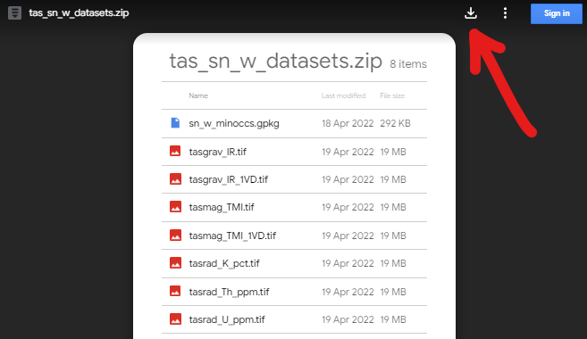

# Geospatial ML Challenges: A prospectivity analysis example

The [Transform 2022 Schedule](https://docs.google.com/spreadsheets/d/e/2PACX-1vTnJ_cTd3Y5nQPoxM-BNTHq96SobJxTliofmqLxBMFnASpKTE9JxmPoqxEnFYPLUw2ZrIiQS8o_wunC/pubhtml)

Instructors:
[Thomas Ostersen](https://www.linkedin.com/in/thomasostersen/) and
[Tom Carmichael](https://www.linkedin.com/in/thomas-carmichael-b0761242/)

## BEFORE THE TUTORIAL

Make sure you've done these things **before the tutorial on Monday**:

1. Sign-up for the [Software Underground Slack](https://softwareunderground.org/slack)
1. Join the channel `t22-mon-ml-models`. This is where **all communication will
   happen**.
1. Set up your computer ([instructions below](#setup)). We will not have time to
   solve many computer issues during the tutorial so make sure you do this
   ahead of time. If you need any help, ask at the `t22-mon-ml-models` channel on
   Slack.

## About

In this tutorial we’ll run a fairly basic random forest prospectivity analysis
workflow applied to tin-tungsten (Sn-W) deposits in northeastern Tasmania. We'll 
use open data sets provided by Mineral Resources Tasmania and Geoscience Australia, 
all of which are available to download from our public [Google Drive](https://drive.google.com/file/d/1ahrYZlvnrZuSdDrwEbhajFrofC3VQPek/view?usp=sharing). The roadmap for the tutorial is as follows:

  - Load and inspect data sets
      - mineral occurrence point data sets with *geopandas*
      - gravity, magnetic and radiometric data sets with *rasterio*
  - Combine data sets to build a labeled Npixel, Nlayers array for model training
      - inspect differences between proximal vs. distal to mineralisation pixels      
  - Train a random forest classifier and apply to all pixels, visualise results
      - evaluate performance with a randomly selected testing subset
      - repeat with stratified classes      
  - Develop a checkerboard data selection procedure, train and evaluate models
      - discuss effects of spatially separated testing data 
  - Investigate occurrence holdout models with a spatially clustered approach

## Prerequisites

- Knowledge of Python is assumed and all coding will be done within a Jupyter notebook
- We'll use [numpy](https://numpy.org/) for data handling and [matplotlib](https://matplotlib.org/) for data visualisation
- Point data sets are handled with [geopandas](https://geopandas.org/), a [pandas](https://pandas.pydata.org/)-like library for vector GIS processing
- [Rasterio](https://rasterio.readthedocs.io/) is used to read and write gridded raster data sets
- The [scikit-learn](https://scikit-learn.org/stable/) implementation of the [random forest](https://scikit-learn.org/stable/modules/generated/sklearn.ensemble.RandomForestClassifier.html) algorithm is used for all modelling
- Class stratification in modelling procedures use the [imbalanced-learn](https://imbalanced-learn.org/stable/) library

---
## Setup

There are a few things you'll need to follow the tutorial:

1. A working Python installation ([Anaconda](https://www.anaconda.com/) or Miniconda)
2. The Geospatial ML tutorial *conda environment* installed
3. A web browser that works with Jupyter notebooks (basically anything except Internet Explorer)

To get things setup, please do the following.

**Windows users:** When you see "*terminal*" in the instructions,
this means the "*Anaconda Prompt*" program for you.

### Step 1

**Install a Python distribution:**

In this tutorial we will be using the [Anaconda](https://www.anaconda.com/)
Python distribution along with the `conda` package manager. If you already have
Anaconda or Miniconda installed, you can skip this step.

If not, please follow Matt Hall's video tutorial from Transform2020: [youtube instructions](https://www.youtube.com/playlist?list=PLgLft9vxdduAW-jmhYqXvtfGYJS6v2FjM)

### Step 2

**Create the `t22-mon-ml-models` conda environment:**

1. Download the `environment.yml` file from
   [here](https://drive.google.com/file/d/1asIZ_M77MbhcL-8sYqwPzWsURleHqBSd/view?usp=sharing)
1. Open a terminal (*Anaconda Prompt* if you are running Windows). The
   following steps should be done in the terminal
1. Navigate to the folder that has the downloaded environment file
1. Create the conda environment by running `conda env create --file environment.yml`
   (this will download and install all of the packages used in the tutorial)

### Step 3

1. Download the zipped data set from our public [Google drive](https://drive.google.com/file/d/1ahrYZlvnrZuSdDrwEbhajFrofC3VQPek/view?usp=sharing), this shoud look like the following screenshot

2. Once downloaded, unzip the data set and copy it to your working directory of choice

### Step 4

**Start JupyterLab:**

1. **Windows users:** Make sure you set a default browser that is **not Internet Explorer**.
1. Activate the conda environment: `conda activate t22-mon-ml-models`
1. Start the JupyterLab server: `jupyter lab`
1. Jupyter should open in your default web browser. We'll start from here in the
   tutorial and create a new notebook together.

### IF EVERYTHING ELSE FAILS

If you really can't get things to work on your computer,
you can run the code online through Google Colab (you will need a Google account).
A starter notebook that installs all the tutorial dependencies and downloads the tutorial data can be found here:

https://colab.research.google.com/drive/1jAW8A4hDdFn4An3I3jtVJiTxzNn08oRU?usp=sharing

To save a copy of the Colab notebook to your own account, click on the
"Open in playground mode" and then "Save to Drive".
You might be interested in
[this tutorial](https://transform2020.sched.com/event/c7Jn/tutorial-using-python-subsurface-tools-no-install-required)
for an overview of Google Colab.

---

## Acknowledgements

This tutorial borrowed HEAVILY from Santiago Soler, Andrea Balza Morales and Agustina Pesce's superb [Harmonica tutorial](https://www.youtube.com/watch?v=0bxZcCAr6bw) from Transform2021, also documented on github here: https://github.com/fatiando/transform21. 

## Data License

All data presented in this tutorial were derived from open data sets made available through [Mineral Resources Tasmania](https://www.mrt.tas.gov.au/) and [Geoscience Australia](https://www.ga.gov.au/).

**LICENSE CONDITIONS**

By exporting this data you accept and comply with the terms and conditions set out below:

[Creative Commons Attribution 3.0 Australia](https://creativecommons.org/licenses/by/3.0/au/)

You are free to:

 - **Share** — copy and redistribute the material in any medium or format
 - **Adapt** — remix, transform, and build upon the material for any purpose, even commercially.

Under the following terms:

 - **Attribution** — You must give appropriate credit, provide a link to the license, and indicate if changes were made. You may do so in any reasonable manner, but not in any way that suggests the licensor endorses you or your use. “
